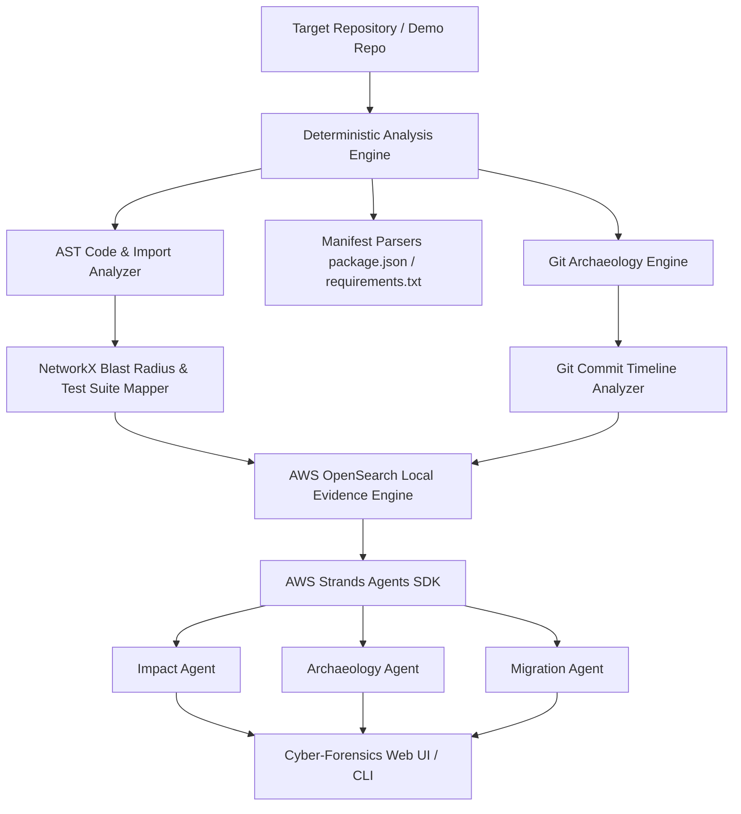

# 🕵️‍♂️ Dependency Detective

### *"Investigate the impact before you change the dependency."*

[](https://github.com/)
[](https://aws.amazon.com/opensource/)
[](docs/privacy.md)
[](LICENSE)

---

## 📌 Problem & Solution

Developers frequently upgrade, remove, or replace dependencies without knowing the actual consequences inside their codebase. Existing tools tell developers package versions or vulnerability CVEs, but fail to answer:

> **"What will happen to MY codebase if I change this dependency?"**

**Dependency Detective** is a local-first developer tool that investigates the blast radius of dependency changes using AST code analysis, Git history archaeology, AWS OpenSearch evidence indexing, and the AWS Strands Agents SDK.

---

## ✨ Key Features

- ⚡ **Hero Feature A — WHAT IF?**: Simulate upgrading, removing, or replacing a package. Displays direct affected files, transitive dependent modules, affected test suites, line-level code evidence, and step-by-step review checklists.
- 📜 **Hero Feature B — DEPENDENCY ARCHAEOLOGY**: Inspects Git history to uncover the introducing commit hash, author, date, original rationale, historical usage changes, and replaceability confidence score.
- 🌐 **Remote Git Repository Analysis**: Enter any HTTPS or SSH Git repository URL (`https://github.com/org/repo.git`) to automatically clone, index, and analyze remote repositories locally.
- 🎯 **Deterministic First, AI Reasoning Second**: Parser and AST analyzers establish line-level facts first. AI agents explain facts using structured evidence—eliminating hallucinations.
- 🔎 **AWS OpenSearch Evidence Indexing**: Searchable local index across repository files, AST symbols, imports, and Git commit logs.
- 🤖 **AWS Strands Agents SDK**: Specialized agent roles (Impact Agent, Archaeology Agent, Migration Agent) orchestrate deterministic evidence tools.
- ⚡ **Cyber-Forensics Developer UI**: Dark obsidian interface with interactive node network grid, expandable code snippet drawers, and keyboard command palette (`Ctrl+K`).
- 🐳 **Finch Container Setup**: Reproducible local environment configured with `finch-compose.yml`.

---

## 🏗️ Architecture



---

## 🛠️ AWS Open Source Technologies

| AWS Technology | Purpose & Integration | Location in Codebase |
| :--- | :--- | :--- |
| **AWS Strands Agents SDK** | Agentic framework orchestrating evidence tools (`get_blast_radius`, `find_usages`, `git_log`). | [`apps/api/app/agents/strands_agents.py`](file:///d:/Projects/Dependency_Detective/apps/api/app/agents/strands_agents.py) |
| **AWS OpenSearch** | Local evidence layer indexing repository symbols, imports, snippets, and commit logs. | [`apps/api/app/search/opensearch_client.py`](file:///d:/Projects/Dependency_Detective/apps/api/app/search/opensearch_client.py) |
| **AWS Finch** | Containerization for reproducible local development environment. | [`infra/finch/finch-compose.yml`](file:///d:/Projects/Dependency_Detective/infra/finch/finch-compose.yml) |

---

## 🚀 Quick Start (Local Run)

### Prerequisites
- Python 3.10+
- Node.js 18+

### 1. Clone & Setup Backend
```bash
git clone https://github.com/your-org/dependency-detective.git
cd dependency-detective/apps/api

# Install dependencies
pip install -r requirements.txt

# Start FastAPI server
python main.py
```
*Backend API will start on `http://localhost:8000`.*

### 2. Setup & Start Web UI
```bash
cd ../../apps/web

# Install frontend dependencies
npm install

# Launch Vite dev server
npm run dev
```
*Open `http://localhost:3000` in your browser.*

---

## 💻 CLI Usage

Dependency Detective includes a standalone command-line interface:

```bash
# Analyze a repository
python scripts/cli.py analyze demo-repository

# Simulate Change Impact (WHAT IF?)
python scripts/cli.py investigate axios --repo demo-repository --version 1.8.4

# Run Dependency Archaeology (WHY IS THIS HERE?)
python scripts/cli.py archaeology lodash --repo demo-repository
```

---

## 🐳 Finch Container Setup

To run the complete stack inside Finch containers:

```bash
cd infra/finch
finch compose -f finch-compose.yml up --build
```

---

## 📖 Documentation Index

- 📐 [Architecture Overview](docs/architecture.md)
- 🤖 [Strands Agent Design](docs/agent-design.md)
- ☁️ [AWS OpenSource Technologies](docs/aws-open-source.md)
- 🏛️ [Architecture Decision Records (ADRs)](docs/decisions.md)
- 🔒 [Privacy & Local Security Model](docs/privacy.md)
- 🛡️ [Threat Model & Security](docs/threat-model.md)
- 🎬 [3-Minute Demo Video Script](docs/demo-script.md)

---

## 📄 License

MIT License — see [LICENSE](LICENSE) for details.
