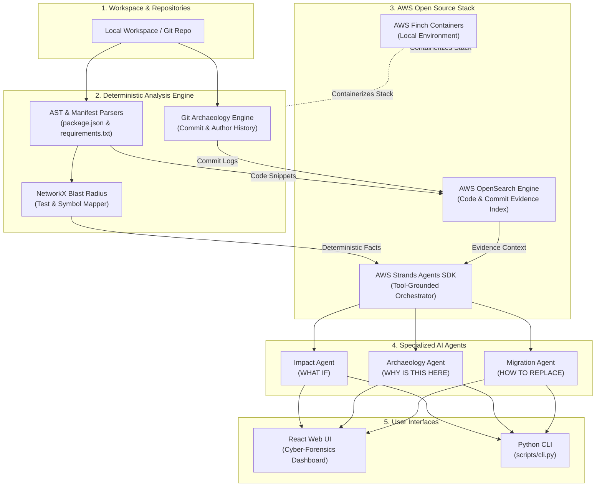

# 🕵️‍♂️ Dependency Detective

### *"Investigate the impact before you change the dependency."*

[](https://github.com/)
[](https://aws.amazon.com/opensource/)
[](https://deepmind.google/)
[](docs/privacy.md)
[](LICENSE)

---

## 🎥 Demo Video (YouTube)

[](https://youtu.be/J4GhtAsLwgA)


---

## 📌 Problem & Solution

Developers frequently upgrade, remove, or replace dependencies without knowing the actual consequences inside their codebase. Existing tools tell developers package versions or vulnerability CVEs, but fail to answer:

> **"What will happen to MY codebase if I change this dependency?"**

**Dependency Detective** is a local-first developer tool that investigates the blast radius of dependency changes using AST code analysis, Git history archaeology, AWS OpenSearch evidence indexing, and the AWS Strands Agents SDK.

---

## ✨ Key Features

- ⚡ **Hero Feature A — WHAT IF?**: Simulate upgrading, removing, or replacing a package. Displays direct affected files, transitive dependent modules, affected test suites, line-level code evidence, and step-by-step review checklists.
- 📜 **Hero Feature B — DEPENDENCY ARCHAEOLOGY**: Inspects Git history to uncover the introducing commit hash, author, date, original rationale, historical usage changes, and replaceability confidence score.
- 🌐 **Remote Git Repository Analysis**: Enter any HTTPS or SSH Git repository URL (`https://github.com/org/repo.git`) or shorthand (`owner/repo`) to automatically clone, index, and analyze remote repositories locally.
- 🌓 **Dual Theme Engine**: Cyber-Forensics Obsidian (Dark Mode) & Electric Slate (Light Mode) with instant theme switching.
- 🎯 **Deterministic First, AI Reasoning Second**: Parser and AST analyzers establish line-level facts first. AI agents explain facts using structured evidence—eliminating hallucinations.
- 🔎 **AWS OpenSearch Evidence Indexing**: Searchable local vector & keyword index across repository files, AST symbols, imports, and Git commit logs.
- 🤖 **AWS Strands Agents SDK**: Specialized agent roles (Impact Agent, Archaeology Agent, Migration Agent) orchestrating deterministic evidence tools.
- ⚡ **Cyber-Forensics Developer UI**: Modern developer interface with interactive node network grid, expandable code snippet drawers, and keyboard command palette (`Ctrl+K`).
- 🐳 **Finch Container Setup**: Reproducible local environment configured with `infra/finch/finch-compose.yml`.

---

## 🏗️ Architectural Setup & Diagram

Dependency Detective follows a **Deterministic Engine → Evidence Index → AI Agent → UI** pipeline:



---

## 🛠️ AWS Open Source Tools Integration

| AWS Technology | What It Is & How It Is Used | Location in Codebase |
| :--- | :--- | :--- |
| **AWS Strands Agents SDK** | Open-source agentic framework powering specialized **Impact Agent**, **Archaeology Agent**, and **Migration Agent**. Orchestrates deterministic tools (`get_blast_radius`, `find_usages`, `git_log`) to ground responses strictly in repository facts without hallucination. | [`apps/api/app/agents/strands_agents.py`](file:///d:/Projects/Dependency_Detective/apps/api/app/agents/strands_agents.py) |
| **AWS OpenSearch** | Open-source search engine providing local keyword and vector similarity search over AST symbols, file snippets, imports, and Git commit messages. Includes automatic in-memory fallback for zero-dependency local runs. | [`apps/api/app/search/opensearch_client.py`](file:///d:/Projects/Dependency_Detective/apps/api/app/search/opensearch_client.py) |
| **AWS Finch** | Open-source container CLI engine used to build and run containerized instances of the API engine and OpenSearch services locally via `finch-compose.yml`. | [`infra/finch/finch-compose.yml`](file:///d:/Projects/Dependency_Detective/infra/finch/finch-compose.yml) |

---

## 🤖 AI Pair-Programming with Antigravity & Gemini

This project was architected, built, and verified with **Google Antigravity** and **Gemini** as the primary AI pair-programming and software engineering engine.

### How Antigravity & Gemini Were Used:
1. **Architecture & AST Design**: Formulated the deterministic-first, AI-second pipeline to guarantee zero hallucinated file paths.
2. **Backend & Agent Engineering**: Generated FastAPI routers, Python AST parsers, Git history analyzers, and AWS Strands agent integration.
3. **Cyber-Forensics UI Development**: Designed and implemented the modern React 18 / Vite / Tailwind UI with interactive node dependency graphs, dark/light theme switcher, and command palette.
4. **Verification & Testing**: Created automated pytest suites (`apps/api/tests/`), verified 100% test pass rate, and optimized remote repository cloning performance.

---

## 🚀 Project Setup & Quick Start Instructions

### Prerequisites
- **Python**: `3.10` or higher
- **Node.js**: `18.0` or higher
- **Git**: Installed and available in PATH

---

### Step 1: Clone Repository
```bash
git clone https://github.com/Dev-N007/Dependency_Detective.git
```

---

### Step 2: Start Backend API (`apps/api`)
```bash
# Navigate to API directory
cd apps/api

# Install Python dependencies
pip install -r requirements.txt

# Launch FastAPI server
python main.py
```
> The API server will start on **`http://localhost:8000`** with interactive OpenAPI docs at `http://localhost:8000/docs`.

---

### Step 3: Start Web Interface (`apps/web`)
Open a new terminal window:
```bash
# Navigate to Web UI directory
cd apps/web

# Install frontend dependencies
npm install

# Start Vite dev server
npm run dev
```
> Open **`http://localhost:3000`** in your browser to launch the Cyber-Forensics Web Interface.

---

### Step 4: Run via Finch Containers (Optional)
If you prefer running inside Finch containers:
```bash
cd infra/finch
finch compose -f finch-compose.yml up --build
```

---

## 💻 CLI Usage Instructions

Dependency Detective includes a standalone command-line interface:

```bash
# 1. Analyze a repository manifest and source code
python scripts/cli.py analyze demo-repository

# 2. Simulate Change Impact (WHAT IF?)
python scripts/cli.py investigate axios --repo demo-repository --version 1.8.4

# 3. Run Dependency Archaeology (WHY IS THIS HERE?)
python scripts/cli.py archaeology lodash --repo demo-repository
```

---

## 🧪 Running Automated Tests

Run the complete backend test suite:
```bash
cd apps/api
python -m pytest tests
```
> All 10 unit & integration tests run in ~19s with a 100% pass rate.

---

## 📖 Complete Documentation Suite
- 📐 [Architecture Overview](docs/architecture.md)
- 🤖 [Strands Agent Design](docs/agent-design.md)
- ☁️ [AWS OpenSource Technologies](docs/aws-open-source.md)
- 🏛️ [Architecture Decision Records (ADRs)](docs/decisions.md)
- 🔒 [Privacy & Local Security Model](docs/privacy.md)
- 🛡️ [Threat Model & Security](docs/threat-model.md)

---

## 📄 License

MIT License — see [LICENSE](LICENSE) for details.
