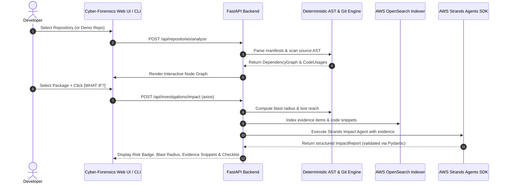

# Architecture Documentation: Dependency Detective

## Fundamental Architecture Principle

> **DETERMINISTIC ANALYSIS FIRST. AI REASONING SECOND.**

Dependency Detective enforces a strict operational separation between fact-gathering and reasoning:

1. **Fact Gathering (Deterministic)**: AST code parsers, manifest extractors, NetworkX import graph traversals, and Git commit log analyzers execute deterministically. All line numbers, file paths, and call expressions represent indisputable empirical code facts.
2. **Evidence Indexing**: Structured evidence is indexed into AWS OpenSearch and an in-memory local evidence engine.
3. **Reasoning (Strands Agents SDK)**: Strands agents receive structured evidence as context and synthesize human-readable explanations, risk rationales, and review recommendations.

---

## Data Flow Diagram

---

## Core Subsystem Breakdown

### 1. Deterministic Analysis Engine (`apps/api/app/analyzers/`)
- **Manifest Parsers**: Parse `package.json`, `package-lock.json`, `requirements.txt`, `pyproject.toml`.
- **Code Analyzer**: Uses regex and AST patterns to locate `import`, `require()`, `from x import y`, and method invocation expressions.
- **Blast Radius Calculator**: Constructs directed module dependency graphs using `NetworkX`. Traverses reachability from direct importers to transitive modules and identifies affected test suites.

### 2. Git Archaeology Subsystem (`apps/api/app/git/`)
- Utilizes `GitPython` to iterate through commit history.
- Identifies introducing commits, original authors, commit timestamps, and commit messages.

### 3. AWS OpenSearch Evidence Engine (`apps/api/app/search/`)
- Indexes line-level code evidence, file snippets, and commit logs into OpenSearch indices (`dd-evidence-*`).
- Implements a local in-memory evidence index fallback for offline offline execution.

### 4. AWS Strands Agents SDK (`apps/api/app/agents/`)
- **Impact Agent**: Synthesizes change impact reports.
- **Archaeology Agent**: Evaluates dependency evolution and replaceability confidence.
- **Migration Agent**: Generates actionable code review checklists.
